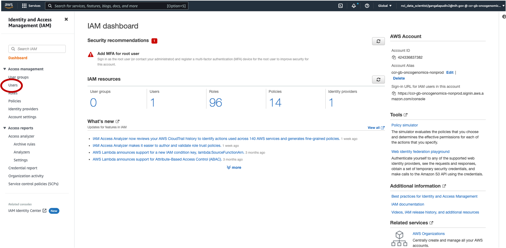
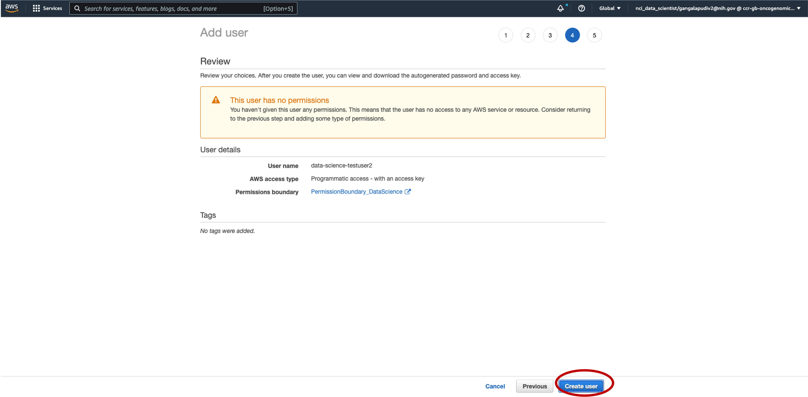

## Adding User on IAM

1. Login to [IAM](iam.cancer.gov) and click on <span style="color:blue">aws (NCI cloud one web console)</span>.
2. In the search box type IAM and click on the popup to reach the IAM dashboard.
3. Click <span style="color:blue">Users</span> tab on the left side of the page.
   
4. Click on <span style="color:blue">Add users</span> tab.
   
5. Enter the User name under Set user details; Username must prefix with data-science-\*
6. Under Select AWS access type select <span style="color:blue">Access key – programmatic access</span> and click Next.
   
7. Leave <span style="color:blue">Set permissions</span> section as it is.
8. Under Set permissions boundary select <span style="color:blue">Use a permissions boundary to control the maximum user permissions</span>
9. In the filter policies search box, type "science" and select <span style="color:blue">PermissionBoundary_DataScience</span> from the drop down then click on Next.
   
10. Skip Section 3 and click Next
    
11. Click on <span style="color:blue">Create user</span>
    
12. New user is created; click on <span style="color:blue">download .csv</span> tab. This file contains the password, Access key ID, secret access key.
    
13. After downloading the csv file, log into biowulf and run the following commands and enter the AWS Access key ID, AWS secret Access Key information from the downloaded csv file.
14. Enter Default region name as us-east-1.
15. Enter Default output format as json.

```
module load aws/current
aws configure
AWS Access Key ID [None]: <enter KeyID here>
AWS Secret Access Key [None]: <enter Access key here>
Default region name [None]: us-east-1
Default output format [None]: json

```

This will enable access to the s3 bucket. You can verify using the `aws s3 ls` command.

```
[gangalapudiv2/ngs_pipeline_testing]$ aws s3 ls s3://ccr-genomics-testdata/testdata/
2023-10-06 14:13:43     184546 Test1_R_T_R1.fastq.gz
2023-10-06 14:13:44     186371 Test1_R_T_R2.fastq.gz
2023-10-06 14:13:44     160880 Test2_R_T_R1.fastq.gz
2023-10-06 14:13:43     163153 Test2_R_T_R2.fastq.gz
2023-10-06 14:13:45     159281 Test3_R_T_R1.fastq.gz
2023-10-06 14:13:44     162359 Test3_R_T_R2.fastq.gz

```
