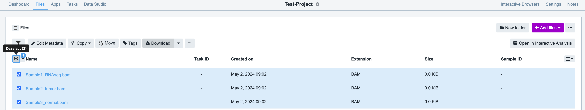

To access Cavatica, log in using your NIH account and PIV card. This will display the projects you have access to on Cavatica.

The easiest way to download files from Cavatica is by following these steps:

1. Log in to Cavatica using your NIH account and PIV card.
2. Navigate to the project containing the files you want to download.
3. Select the checkbox next to each file you want to download.
4. Click the download button located at the top of the page.



This method is particularly useful when dealing with a small number of files or files of small sizes.

For handling large numbers of files and files with substantial sizes such as FASTQs, VCFs, or BAM files, it's recommended to utilize the Seven Bridges python API.

You can find instructions on how to download and use the API in the official documentation: [Seven Bridges python API](https://sevenbridges-python.readthedocs.io/en/latest/)

Using the API offers more efficient and flexible options for managing and downloading files from Cavatica, particularly when dealing with large datasets in nested folders.

To access the data using API,

1. Obtain the authentication token from the `Developer` tab at the top of the Cavatica page.
2. Identify the API end point for Cavatica, this information can be found [here](https://sevenbridges-python.readthedocs.io/en/latest/quickstart.html#authentication-and-configuration).For Cavatica env API end point is https://cavatica-api.sbgenomics.com/v2
3. Install the [seven bridges python package](https://sevenbridges-python.readthedocs.io/en/latest/installation.html) in your conda env on biowulf or local machine.
   

```
#!/usr/bin/env python
from sevenbridges import Api
from sevenbridges.http.error_handlers import rate_limit_sleeper, maintenance_sleeper
import requests
import os
import sys

# Initialize the Seven Bridges API client.
api = Api(url='https://cavatica-api.sbgenomics.com/v2', token='input-your-token-here',error_handlers=[rate_limit_sleeper, maintenance_sleeper])

# List all the projects you have access to.
for project in api.projects.query().all():
    print ("ID: ", project.id, " Name:", project.name)

#View subfolders of a specific project
#project name should be provided in this format - user/projectname example: gangalapudiv2/test
root_folder = api.files.query(project='Enter-your-project-name-here') 
for folder in root_folder:
    print(folder.id, folder.name) # Prints folder id and folder name for all the subfolders in this project

#View meta data information for all the files within a folder/subfolder.
total_file_size = 0
num_files = 0
#using .all() to get list of all files in the subfolders.
folder = api.files.get(id='Provide-folder-id-here')
folder_subfolders = folder.list_files().all()
for subfolder in folder_subfolders:
        if subfolder.type == 'folder':  # Check if it's a folder
            print("Subfolder: ", subfolder.name)
            sb = api.files.get(id=subfolder.id)
            files = sb.list_files().all()
            for file in files:
                num_files += 1
                print("File ID: ", file.id)
                print("File Name: ", file.name)
                print("File Metadata: ", file.metadata)
        else:
            print(f"Skipping {subfolder.name} because it's not a folder.")

```

#Downloading files:

Get a list of file_ids from the above step. 

```
file_id = sys.argv[1]
file_obj = api.files.get(file_id)

original_name = file_obj.name
file_obj.download(path=f'./pathtoyourfolder/{original_name}')

print("File downloaded successfully!")
```

If you have any questions or would like to provide valuaable additions to thhis page plase email [Vineela Gangalapudi](mailto:vineela.gangalapudi@nih.gov).


