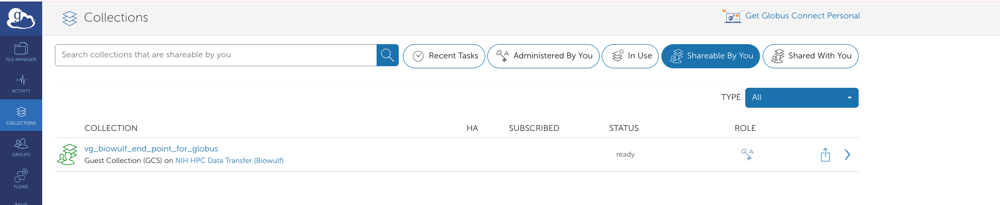
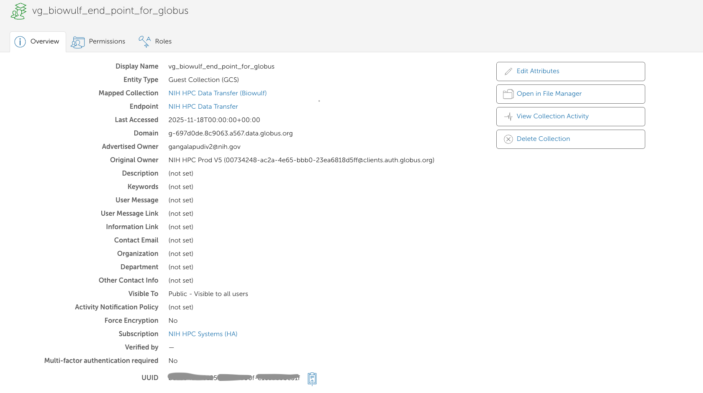
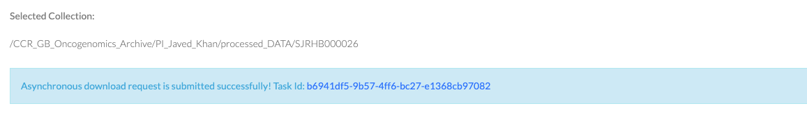

# Downloading data from DME via Globus

This page describes how to download data from the DME (Data Management Environment) to a NIHHPC-biowulf using **Globus**.

## Prerequisites

- Active DME access with the appropriate project permissions
- A Globus account linked to your institutional login

## 1. Log in to Globus

1. Go to the [Globus web app](https://app.globus.org/).
2. Click **Log In**.
3. Choose your institution / organization as the identity provider.
4. Complete the login and any MFA that’s required.

For full step-by-step instructions from the DME team, see:

[Preparing to Use Globus (NCI Wiki)](https://wiki.nci.nih.gov/spaces/DMEdoc/pages/378145904/Preparing+to+Use+Globus)

## 2. Use the DME wiki page to complete the following setup steps:

1. Set up a destination directory on Biowulf to serve as the Globus endpoint (e.g., a folder in your /data or lab space) 
2. On globus, create a new Guest Collection for your Biowulf download location.
3. Grant access to the **HPCDME-PROD-App-Accts-Pool-FNLCR** group, which allows the DME service account to write files into your collection

## 3. Locate your Guest Collection and copy its UUID

1. In the Globus web app, click Collections in the left sidebar and select filter `shareable by you`.
2. Select the Guest Collection you created for Biowulf downloads.
  
3. On the collection’s main page, locate and copy the Collection UUID — you’ll need this when initiating transfers from DME or setting up scripted workflows.
  

## 4. Initiate the download from HPC-DME

1. Log in to the HPC-DME portal and navigate to the sample or dataset you want to download.

2. Right-click the file or folder and open the Details page.

3. In the field for Globus Endpoint UUID, paste the UUID of your Biowulf Guest Collection (copied in Step 3) and click download.

4. Download request will be created and submitted to the queue. The data will be available in the endpoint within the same day.

  